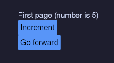
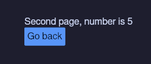

# How to make a multi-screen/-page/-layout `iced` Rust GUI

I could not find a good tutorial on how to write an iced app that has 2 or more pages (think login and dashboard, not
windows!). This repo is a tutorial on how to do so. You can either keep reading or look at the code. There is a TR;DR at
the end too.

## Example app used for this tuturial

I intend to show how to do 2 things: pass `Message`s within each "page" and how to switch from one "page" to
another. A simple example thus would be:

First page contains a text displaying a number and a button that increments that number. This shows you how to contain
state within one page and emit messages to update it. It will also contain a button that will send the current value
of the number to the second page. This shows how to pass messages to other page and switch bewtween them.



The second page will display the value of the number from the first page and a button that will return us to the first
page. When we return to the first page the state will be reset to `number = 1`, but you can preserve the value.



### Adding a page stack (homework)

I will not be implemnting a page stack (where you push a page and then pop it to return to the exact state of the
previous page). However, this is very easy to implement.

In the `App` struct that you will see later, simply hold a `Vec` of `enum PageState` instead of `App` being that
`PageState` itself.

Then in the `Message` add 2 variants to replace the `SwitchPage` variant: `PushPage(PageState)` and `PopPage`
(optionally `PopPage` can hold some state that can update the state of the previous page). Then just implement the
logic to push and pop pages in the `App`'s `update` method and use the `.last()` or `.last_mut()` to get the current
page in `view`.

## How do we make an iced app again?

Maybe I should've read the iced book. I did not. I wanted to jump right in. If you did the same then here you go:

Iced tells you to implement a trait for some type. In this tutorial this type will be called `App`, but more often you'd
see a name like `TextEditor`. I find such naming to be confusing, so I call mine `App`. Makes it clear what that type
does right in the name that you may see in parameters or return types.

In this example we use the `Sandbox` trait, which is just like the `Application` trait, but simpler. Either way the
interface is nearly identical for our usecase.

This trait has 2 methods that we care about: `view` and `update`. Everything else is boilerplate.

- The `view` method in its signature suggests exactly what you have to do: take state and convert it to your UI:

    `fn view(&self) -> Element<Self::Message>`

- The `update` method also suggets that you convert messages into changes to your state, presetented by `self` (state is
    then used in the `view`):

    `fn update(&mut self, message: Self::Message)`

## Writing the type for `App`

Since `App` holds the state of our app, and the top level state that we have here is the page currently opened, we are
going to use an `enum` instead of a `struct`:

```rust
#[derive(Debug, Clone)]
pub enum App {
    FirstPage(FirstPage),
    SecondPage(SecondPage),
}
```

Now lets create 2 modules to hold code for each page:

```rust
pub mod page {
    pub mod first;
    pub mod second;
}
```

**page/first.rs:**

```rust
#[derive(Debug, Clone)]
pub struct FirstPage(pub u8);
```

**page/second.rs:**

```rust
#[derive(Debug, Clone)]
pub struct SecondPage(pub u8);
```

And we can initialize the `App` to start at `FirstPage(1)`.

```rust
fn main() -> iced::Result {
    App::run(Settings::default())
}

impl Sandbox for App {
    /// Provide initial state for `main() { App::run() }`
    fn new() -> Self {
        Self::FirstPage(FirstPage(1))
    }

    fn title(&self) -> String {
        "Two page app".to_string()
    }

    // we will get to other required trait members later ...
}
```

Now lets implement the 2 trait functions that we actually care about: `view` and `update`.

# `view` logic

In the `view` we will delegate rendering to the types that contain state for each page.

**main.rs:**

```rust
#[derive(Debug, Clone)]
pub enum Message {
    FirstPage(FirstPageMessage),
    // SecondPage(SecondPageMessage) isn't defined because second page doesn't
    // have any messages
    SwitchPage(App),
}

impl Sandbox for App {
    type Message = Message;

    fn view(&self) -> Element<Self::Message> {
        match self {
            App::FirstPage(page) => page.view(),
            App::SecondPage(page) => page.view(),
        }
    }
}
```

**page/first.rs:**

```rust

#[derive(Debug, Clone)]
pub enum FirstPageMessage {
    IncrementButton,
}

impl FirstPage {
    pub fn view(&self) -> Element<Message> {
        column! {
            text(format!("First page (number is {})", self.0)),
            button("Increment")
                // emit a message within this screen
                .on_press(FirstPageMessage::IncrementButton.into()),
            button("Go forward")
                // emit a message to switch to a different screen and pass some
                // to that screen
                .on_press(Message::SwitchPage(
                    App::SecondPage(SecondPage(self.0))
                ))
        }
        .into()
    }
}

impl From<FirstPageMessage> for Message {
    fn from(message: FirstPageMessage) -> Self {
        Self::FirstPage(message)
    }
}
```

**page/second.rs:**

```rust
// second page doesn't pass any messages, only uses the `SwitchPage` variant on
// the global `Message` (defined in main.rs)

impl SecondPage {
    pub fn view(&self) -> Element<Message> {
        column!(
            text(format!("Second page, number is {}", self.0)),
            // emit a message to go back to first screen
            button("Go back").on_press(Message::SwitchPage(
                App::FirstPage(FirstPage(1))
            ))
        )
        .into()
    }
}
```

If you were to change the `<App as Sandbox>::new()` to return the `SecondScreen`, you could see the second screen.
However this cant be done at runtime. Let's implement it now.

## `update` logic

In `update` we need to react to 2 kinds of messages:

1. `Message::SwitchPage(new_app_state: App)` - Sets `&mut self: App` to the `new_app_state`
2. `Message::SomePage(message)` - This one is trickier. We want to delegate the update logic for each page to
    `SomePage::update()`. Each page will have its own `SomePageMessage` type which unloads the global `Message` enum
    too. There should not ever be a case where a page would send or recieve any messages that aren't contained within
    its variant in the global message (except the `SwitchPage` variant that `App` will handle itself). So we will code
    that into the type system: `update` for `SomePage` recieves `SomePageMessage` and `App`'s `update` assumes
    that `App` is of variant `SomePage` and that the message is of the `SomePage` variant. If that is not the case,
    well, panic i guess?

Now the code:

**main.rs:**

```rust
impl Sandbox for App {
    // this funny self signature is required for the match to work
    fn update(mut self: &mut Self, message: Self::Message) {
        match (&mut self, message) {
            // regardless of the self state, update self to the new state
            //
            // this is where you can implement the `PushPage` and `PopPage`
            // functionality if you want a page stack.
            (_, Message::SwitchPage(new)) => *self = new,

            // Only if the page variants match in `App` and `Message` do we
            // handle the message
            //
            // Repeat for each page in the app
            (App::FirstPage(page), Message::FirstPage(message)) => {
                page.update(message);
            }

            // If the `App` and `Message` variants didn't match, panic.
            (page, message) => panic!(
                "Incorrect message routing:\n\
                page {page:?}\n\
                recieved message {message:?}"
            ),
        }
    }
}
```

**page/first.rs:**

```rust
impl FirstPage {
    pub(crate) fn update(&mut self, message: FirstPageMessage) {
        match message {
            FirstPageMessage::IncrementButton => self.0 += 1,
        }
    }
}
```

**page/second.rs:**

*This page doesn't emit or handle any messages.*

## TL;DR

`App` is an enum over states of each page. To switch from one page to another emit a `Message::SwitchPage` with the
value to be assigned to `App`.

Each page has its own enum over its messages. A page is only allowed to send and recieve messages in that enum. The only
exception are messages that are handeled by the `App` like `SwitchPage`.

Each page has its own `fn view`. The `App`'s `view` delegates rendering to it.
